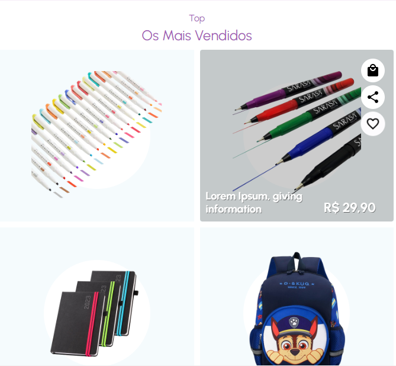
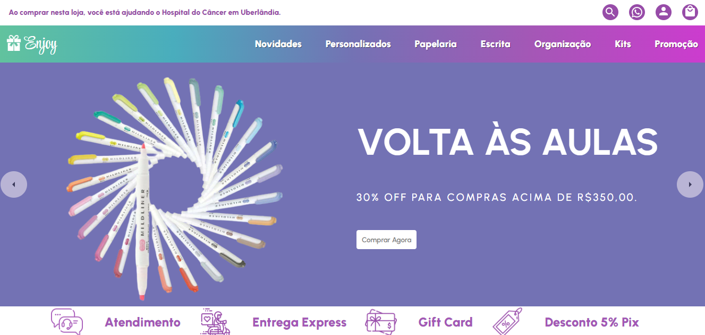

 

  <h1>Bem Vindos(as)</h1>
  <strong>Ecommerce</strong>
  <h6>Feito com ❤️ by DebsLorena</h6>

 

## ✌️ Ecommerce

    
    
    
    <h6>Feito com ❤️ by DebsLorena</h6>
    <a href="https://www.linkedin.com/in/loredebs/"><strong>Linkedin</strong></a> 
    <a href="https://www.instagram.com/debslorena/"><strong>Instagram</strong></a>

    

### 🎨 Frontend

*  **ReactJS**: com Visual Studio Code :hammer: Em processo de finalização.

### 🏗 Backend

* :hammer: Em contrução

## 🏛 Architecture

* :hammer: Em contrução

## 🗂 Tech Stack

Below is a list of technologies we use at

* :hammer: Em contrução

## 🙌 Quer Contribuir?

Estamos abertos a todos os tipos de contribuições. Se você quiser:
* 🤔 Sugira um recurso
* 🐛 Informar um problema
* 📖 Melhore a documentação
* 👨‍💻 Contribua com o código

Você é mais que bem vindo. 

Obs: Todos os textos e imagens atuais são ficticios, projeto não concluso.

    <h6>Feito com ❤️ by DebsLorena</h6>
    <a href="https://www.linkedin.com/in/loredebs/"><strong>Linkedin</strong></a> 
    <a href="https://www.instagram.com/debslorena/"><strong>Instagram</strong></a>

